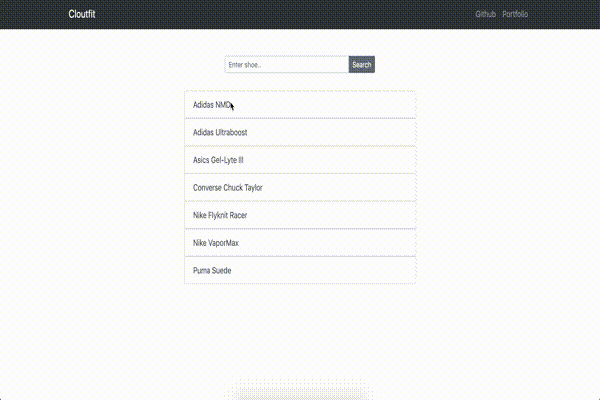

<!-- prettier-ignore-start -->
# Cloutfit

Sneaker fashion lookbook to help curate an outfit on the fly. Contains styles for men and women, and gives several options on what to wear depending on the shoes you decide to wear for the night.

## Objectives

* [x] 📝 Diagram the Full Stack
* [x] 🔎 Differentiate between Client and Server
* [x] ⌨️ Get user search input on the Client
* [x] ➡️ Send user input from the client with fetch to the server
* [x] 🔍 Retrieve data from a database on the Server
* [x] 👀 Show images on the client
* [x] 🙈 Hide shoe names on the client
* [x] 🚀 Deploy the database with mLab
* [x] 🚀 Deploy the client with Heroku
* [x] 🚀 Deploy the server with Heroku

<!-- prettier-ignore-end -->
